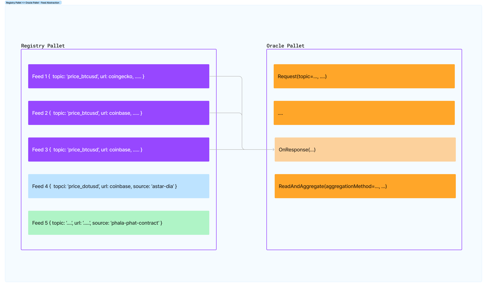

# Oracle Parachain

The goal of this project is to offer a data aggregation and trustless oracle system as native parachain in the
DotSama ecosystem. This means:

- Registering new feeds
- Consuming data from a registered feeds (aka. sources) via XCM
- A staking / slashing mechanism to ensure the game-theoretic elements of the process


## Architecture

The Substrate-based chain in development primarily relies on 2 pallets:

1. Registry Pallet
2. Oracle Pallet

The functionalities built using the pallets above abstract the registration of a feed (Feeds are defined in [details below](#feed-metadata)) as well as process for requesting data from a decentralized feed ([see details](#feed-request)).

In this implementation, we abstract the concepts of a singular Feed (a data source) and the action of getting data over HTTP (e.g. using Phat contracts or offchain workers) which the Oracle pallet manages.


### Registry Pallet

> Reference: [pallet-registry](./pallets/registry)

The registry pallet is responsible for creating new entries of `ApiFeed<T>` and keeping track of them in storage.

Each entry holds the metadata of a [data source](#feed-metadata) (i.e. a URL pointing to an API to get data from along with an identifier). 

The reason for a registry being created is to enable adding staking / slashing mechanism. Creating new feeds will require a stake to be placed along with the metadata about that feed.

If the source of data is consistently honest, rewards are paid to the feed owner accordingly (from fees).

Slashing can occur if the feed source is found to deviate too far from other feeds / sources for the same topic.

> Note: Deviations from "normality" in feed data can be determined by aggregation methods.


#### Feed Metadata

The feed metadata is a struct responsible for holding data pretaining to a specific source of information about a specific topic. For example, if we would like to create a feed for Polkadot's price in USD, the topic can be `dot_usd_price` and the URL can be pointing to a public API providing the price of Polkadot (via URL query parameters) such as CoinGecko.

This is completely separate for "how?" the data is requested over HTTP. In the 

> Note: A `topic` which is an identifier used for aggregation as well as determining threshold of error.

This allows for the abstraction feature of this oracle system. Multiple sources are aggregated for the same topic. 

The choice of this architecture becomes clear when you consider a separation of concern between the action of getting data over HTTP and the management of data sources along with feed ownership.

> Reference: [ApiFeed<T>](./pallets/registry/src/lib.rs)


### Oracle Pallet

The oracle pallet is responsible for managing the process of requesting data from a feed (i.e. a data source) and aggregating the data from multiple sources for the same topic.



The diagram above shows how the feeds are registered in the registry pallet and then used by the oracle pallet to request data using the provided API sources.

Requesting data from the Oracle pallet is done via RPC (current implementation) and will be available over XCM as well.

> Reference: [pallet-oracle](./pallets/oracle)


#### Feed Request

At the current stage of the PoC, the Oracle pallet is reachable via RPC requests. This means that a user can request data from a feed by sending a request to the Oracle pallet via RPC.

> Note: This project intends to utilize the power of XCM as a request-response channel for other parachains to request data from the Oracle.

Each data request must include an identifier for the feed or a topic (abstracts over multiple sources). Data requests can also specify an aggregation method to be applied to the data sources.

Each data request is associated with a randomly generated ID which provides identification for the request. This ID is used to retrieve the data from the Oracle pallet.

#### Phala Phat Contracts

The current implementation leverages Phat contracts to request data from an API URL (i.e. feed source). This is done by creating a contract which is then deployed on the Phala network. The contract is responsible for requesting data over HTTP and then sending it back to the Oracle pallet.

This is only one method for getting data over HTTP (i.e. offchain), however, the Oracle pallet is responsible for abstracting away the method of getting data over HTTP. This means that the Oracle pallet can be used with any method of getting data over HTTP (e.g. offchain workers or smart contracts deployed on other networks like Astar with DIA).

> Reference: [phat README](./phat/README.md)

#### Offchain Workers

Offchain workers offer an alternative to Phat Contracts for fetching data over HTTP. The usage of offchain workers is approached as a connection pool to allow getting data from the offchain world.

> Note: other TEE solutions can be used as well to increase the trust-less-ness of the data sources.

---

## Getting Started (Development)

To start development locally for this project, follow these steps:

### Build the parachain

```
cargo build --release
```

### Run a zombienet
To test the parachain along with a Relay chain, we can use [Zombienets](https://github.com/paritytech/zombienet). The instructions are in the Zombienet repository.

---

## Contributions
