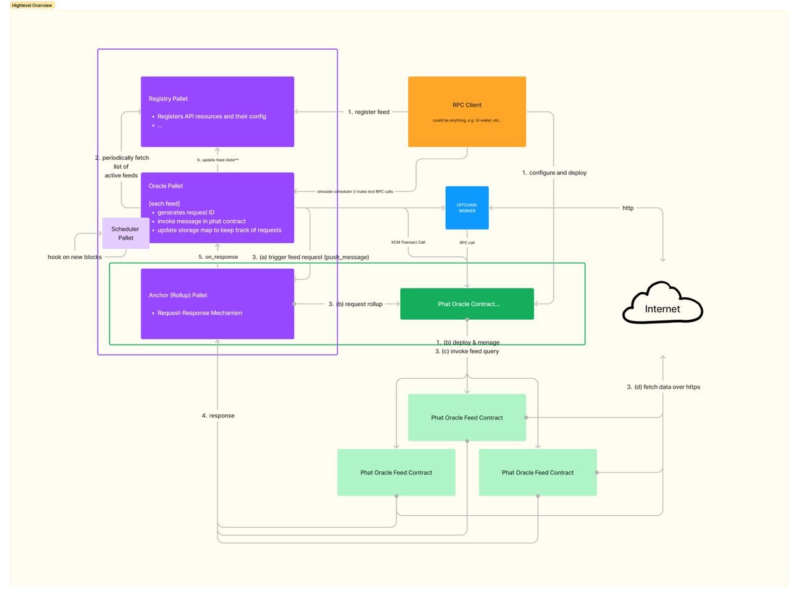

# Oracle Parachain

The goal of this project is to offer a data aggregation and trustless oracle system as native parachain in the
DotSama ecosystem. This means:
- Registering new feeds, 
- Consuming data from a registered feeds (aka. sources) via XCM,
- A staking / slashing mechanism to ensure the game-theoretic elements of the process.

The value ...


## Architecture

The Substrate-based chain in development primarily relies on 2 pallets:

1. Registry Pallet
2. Oracle Pallet

The functionalities built using the pallets above abstract the registration of a feed (Feeds are defined in [details below](#feed-metadata)) as well as process for requesting data from a decentralized feed ([see details](#feed-request)).

In this implementation, we abstract the concepts of a singular Feed (a data source) and the action of getting data over HTTP (e.g. using Phat contracts or offchain workers) which the Oracle pallet manages.




### Registry Pallet

> Reference: [pallet-registry](./pallets/registry)

The registry pallet is responsible for creating new entries of `ApiFeed<T>` and keeping track of them in storage.

Each entry holds the metadata of a [data source](#feed-metadata) (i.e. a URL pointing to an API to get data from along with an identifier). 

The reason for a registry being created is to enable adding staking / slashing mechanism. Creating new feeds will require a stake to be placed along with the metadata about that feed.

If the source of data is consistently honest, rewards are paid to the feed owner accordingly (from fees).

Slashing can occur if the feed source is found to deviate too far from other feeds / sources for the same topic.

> Note: Deviations from "normality" in feed data can be determined by aggregation methods.


#### Feed Metadata

The feed metadata is a struct responsible for holding data pretaining to a specific source of information about a specific topic. For example, if we would like to create a feed for Polkadot's price in USD, the topic can be `dot_usd_price` and the URL can be pointing to a public API providing the price of Polkadot (via URL query parameters) such as CoinGecko.

This is completely separate for "how?" the data is requested over HTTP. In the 

> Note: A `topic` which is an identifier used for aggregation as well as determining threshold of error.

This allows for the abstraction feature of this oracle system. Multiple sources are aggregated for the same topic. 

The choice of this architecture becomes clear when you consider a separation of concern between the action of getting data over HTTP and the management of data sources along with feed ownership.

> Reference: [ApiFeed<T>](./pallets/registry/src/lib.rs)


### Oracle Pallet

....

> Reference: [pallet-oracle](./pallets/oracle)


#### Feed Request

...


#### Phala Phat Contracts

...

> Reference: [phat README](./phat/README.md)

#### Offchain Workers

...


---

## Getting Started (Development)

To start development locally for this project, follow these steps:

### Build the parachain

```
cargo build --release
```

### Run a zombienet
To test the parachain along with a Relay chain, we can use [Zombienets](https://github.com/paritytech/zombienet). The instructions are in the Zombienet repository.

#### Phat

lorem ipsum

##### Run rollups test

```
cd ~/phat-offchain-rollup/phat

yarn install

reset && yarn devphase contract test
```


---

## Contributions
