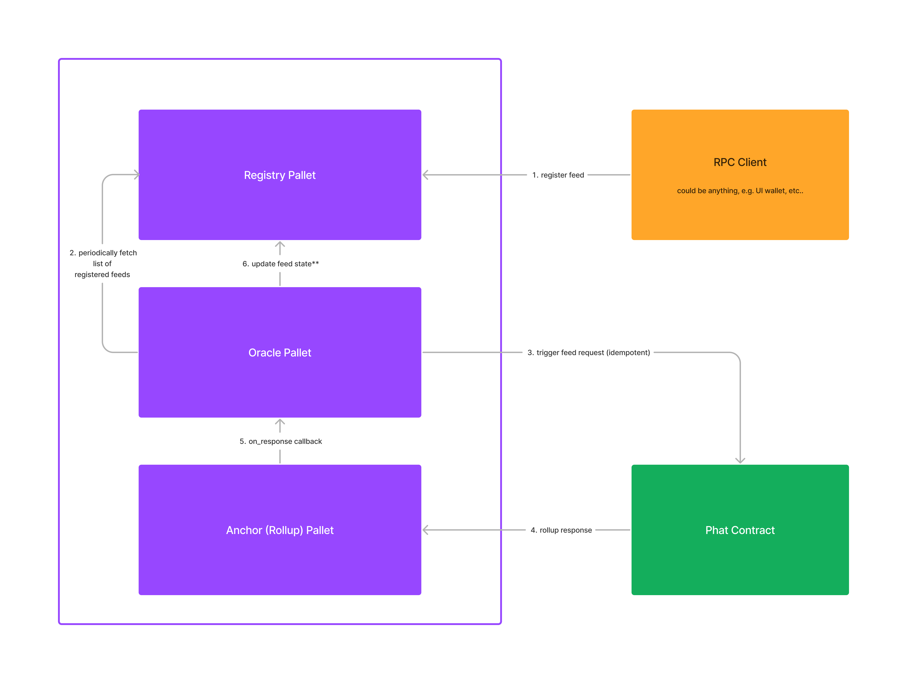
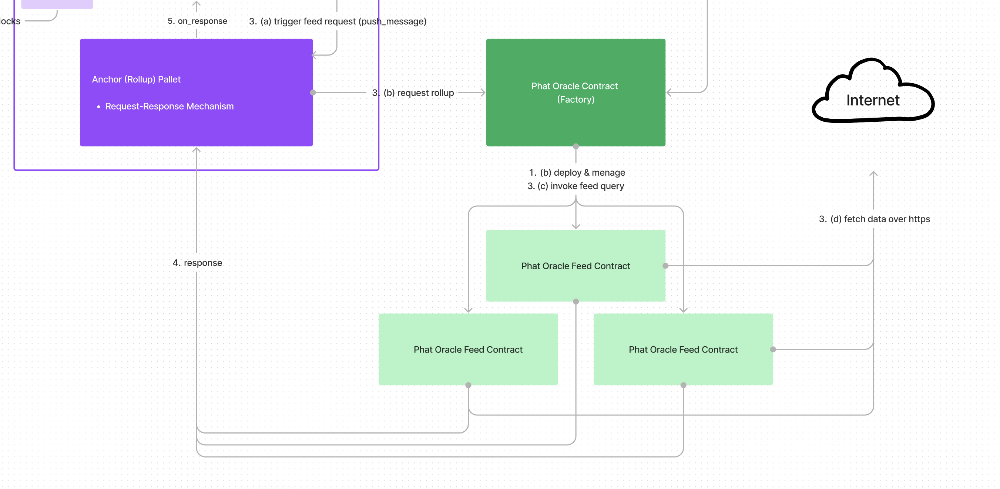

# Substrate Oracle with Phat Contract Offchain Rollup

This sub-project is adapted from [Phat Offchain Rollup](https://github.com/Phala-Network/phat-offchain-rollup) repository
which is also a dependency of the contracts written here.

The phat contracts mainly concern themselves with fetching data via HTTPs within the Phala offchain workers environment.

The request-response programming model implemented by the offchain rollup pallet linked above enables pallets within Paraxiom (this project // the Oracle chain) to receive data from phat contracts as well as send requests for getting the data.

The diagram below shows the relationship of the pallets to the phat contract(s).




## Getting Started


### Set up

Make sure you've got Node 16 installed. Then proceed to install `yarn` by running `npm install -g yarn`.

You can run `node -v` to make sure you've got some subversion of 16 running.

Now we'll need to install the `node` dependencies:

```
yarn install
```


### Compiling Contracts

For the contracts to be compiled, we'll use `cargo-contract`:

```
cd ./contracts/phat_oracle
cargo contract build --release
```

> Note: this will automatically ensure you've running the correct version of `cargo` and `cargo contract`. You may need to install some dependencies to build successfully.

Another way to compile contracts would be to use the `@devphase/cli` npm package which is used to facilitate a number of boilerplate dev processes.

To compile contracts with `devphase`, running the following command from the `/phat` directory:

```
rm -rf ./target
npx @devphase/cli contract compile
```

This command will compile every contract in the `contracts` directory.


### Running Tests

#### Unit Tests

Running the unit tests within each contract can simply be done by running `cargo test`.

#### E2E Tests

We can use `@devphase/cli` to run tests as well:

```
npx @devphase/cli contract test
```

The command above will attempt to do 3 things:

1. Have a dev instance of the phala network running locally
2. Compile the contracts
3. Deploy the contracts and run the tests found in `/tests` directory

Alternatively, the steps mentioned above can also be done manually by doing the following:

1. Run the phala stack by using `npx @devphase/cli stack run`
2. Prepare the stack by using `npx @devphase/cli stack setup` in another terminal window
3. Compile and deploy contracts in whichever way you prefer


### Using Testnets

The tests can be configured to run against a testnet (e.g. PoC-5) by simply configuring the environment file.

```
cp .env_sample .env
```

Then proceed to edit the new created `.env` file. Values such as `RPC` are used to specify endpoints for the contract to communicate with.


## Technical Overview

The main aspect of this subproject are contained within 2 phat contracts:

1. `phat_oracle` - This is a factory contract to deploy new feed contracts and manage them.
2. `phat_oracle_feed` - this contract is responsible for fetching data and reporting it.




### Phat Oracle

Whenever a feed is registered (via the [`Registry` pallet](../pallets/registry/)) a new `PhatOracleFeed` contract is deployed. This contract is then registered with the `PhatOracle` contract.

The `PhatOracle` contract is also responsible for managing the `PhatOracleFeed` contracts. It does this by keeping track of the `PhatOracleFeed` contracts and their respective `PhatOracleFeed` contract addresses.

Interaction with this phat contract will most likely be done via the [`Oracle` pallet](../pallets/oracle/).

### Phat Oracle Feed

The `PhatOracleFeed` contract is responsible for fetching data from a given URL and reporting it to the `PhatOracle` contract.

It is also responsible for parsing the raw data into a format that can be used by the `Oracle` pallet.

Interaction with this phat contract the `PhatOracle` contract however feed values are sent to the `Oracle` pallet directly via the rollup request-response flow.
